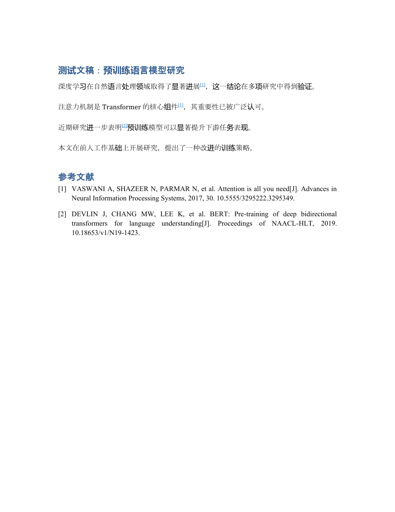

<div align="center">

# ✨ Want one-click references for your whole paper?

## ⚡ Want to save tons of time and effort?

### 🎯 Just use this skill!

**Direct Citation Assistant**

</div>

**[English](README.en.md) | [简体中文](README.md)**


> A Zotero-free, script-driven citation workflow for Word: from "sentence-by-sentence citation judgment" → "literature search & filtering" → "clickable hyperlink citations" → "auto-generated reference list".

Supports **journal papers, theses (proposal / mid-term reports), and course papers**, with mixed **Chinese & English references**. Reference formatting follows **GB/T 7714-2015** (default), plus APA / Vancouver / MLA.

---

## ✨ Features

| Capability | Description |
|---|---|
| 🗂️ Auto workspace | One command creates the project folder (论文 / 引用目录 / 文献, i.e. drafts / citation list / PDFs) — automatically placed outside drive C: |
| 🔍 Sentence-level judgment | A concrete checklist for deciding whether each sentence needs a citation, avoiding citation padding |
| 🎯 Three search principles | Strongest evidence first → newest first → highest citation count; covers both Chinese & English literature |
| 🔗 Hyperlink citations | In-text numbers (superscript by default) are **clickable and jump** to the matching entry in the reference list; entry **DOIs are clickable too** and open the paper page |
| 📚 Multi-doc chapters | Process several `.docx` chapters at once with one continuous numbering; citations **jump across documents** to the main document's reference list (verified in Word) |
| 🔢 Auto renumbering | Re-run after deleting / adding a citation — numbers update automatically, no manual fixing |
| 📑 Four formats | GB/T 7714 (default), APA, Vancouver, MLA; numbered + author-year (**a/b suffixes auto-applied for same author & year**) |
| ✒️ Italic by spec | Western journal/book names automatically italic per GB/T 7714; Chinese journal names stay upright (`--no-italic-source` to disable) |
| 🔎 Citation authenticity | **No fabricated references**: `verify_refs.py` checks each entry online via Crossref DOI / OpenAlex title — ✅ verified / ⚠️ mismatch / ❌ not found / 🔶 offline — plus field completeness & the `note` support sentence |
| 🔗 Citation mapping | `insert_refs.py --mapping` prints a "in-text ↔ reference" table (number, sentence, `note`) to verify every citation actually backs its sentence |
| 🌐 Site checks | Built-in list of 18 literature-search sites, availability checked by code, with scheduled updates |
| 📝 Complete GB format | Journal, conference, **book [M], thesis [D], web page [EB/OL]** all rendered per GB/T 7714 |
| 🀄 Chinese friendly | Chinese keys in placeholders (`[CITE:注意力机制]`), case-insensitive; Chinese references & journal names handled automatically |
| ✒️ Auto typography | Chinese: SimSun (宋体) + Western/digits: Times New Roman; hanging indent 2 chars, justified, tab-aligned numbers |
| 📄 PDF archiving | Downloaded papers renamed by title and archived; name collisions get numbered suffixes, never overwritten |
| 💾 Auto backup | Every docx / refs.csv modification is backed up first (last 30 kept) |

---

## 📸 Screenshot



> A real rendered screenshot: three superscript citations `[1][1][2]` in the body are clickable and jump to the matching entries; the 「参考文献」 list at the end is auto-generated with a 2-character hanging indent, tab-aligned numbers, and a 1:1 match with the in-text citations. Demo assets and automated tests are included — you can reproduce it yourself.

---

## 🆕 What's New

**v1.7.1 (latest)**
- 🖱️ **One-click batch scripts**: `转占位符草稿.bat` (drag a docx onto it → convert to plain-text draft) and `恢复引用.bat` (drag the AI-edited docx → restore hyperlinks/numbering/bibliography, auto-runs `--mapping` for the check table) — no need to memorize commands

**v1.7.0**
- 🤖 **"AI edits killed my hyperlinks" is now solved**: new `insert_refs.py --to-placeholders` — before handing the paper to an AI/editor, convert citation hyperlinks back into plain-text `[CITE:key]` placeholders and drop the bibliography; any text editing can't break them, and re-running the script afterwards restores hyperlinks, numbering and the bibliography (verified end-to-end: python-docx rewrite → re-run → all 3 citations restored)

**v1.6.1**
- 📖 Docs: "add/remove citations" maintenance — auto-renumber after deletion, **3-step insertion for an advisor-specified paper** (`[CITE:key]`), and the risks of manual editing (final-only)

**v1.6.0**
- 🔎 **Metadata cross-check upgraded**: on exact DOI hit, besides the title, **year / volume / issue / pages** are now compared against the authoritative record — any mismatch flags ⚠️ (catches "real paper but wrong vol/issue/pages")
- 🈴 **Chinese-literature coverage note**: OpenAlex covers Chinese titles sparsely; a real Chinese paper may be flagged ❌ — confirm it on CNKI/Wanfang manually; fixed the OpenAlex edition-year false positive (2017 paper matched a 2025 reprint)

**v1.5.0**
- 🔗 **Clickable DOIs**: DOIs in reference-list entries become hyperlinks straight to the paper page (External links, verified in Word, idempotent re-runs); GB format now renders DOIs as `https://doi.org/…`
- 📑 **Author-year a/b suffixes**: same author & same year → auto `2023a`/`2023b` by title order, in both in-text labels and the list (per GB/T 7714)
- 🔎 **note quality check**: `verify_refs.py` now flags a `note` shorter than 6 chars — spell out exactly which sentence/claim the paper backs
- 📋 **Top-tier checklist**: SKILL.md adds a pre-submission checklist (authenticity / support / no fabrication / no extras & no gaps / format / in-text placement / ordering / recency / traceability)

**v1.4.0**
- 🔎 **Citation authenticity check** (new `verify_refs.py`): every reference verified online against Crossref DOI / OpenAlex title — ✅ verified / ⚠️ mismatch / ❌ not found (likely fabricated — fix or remove before writing into your paper) / 🔶 offline; `--offline` field-only, `--report` exports a check report — **no fake references make it into your paper**
- 🔗 **Citation mapping** (`insert_refs.py --mapping`): prints an "in-text ↔ reference" table (number, sentence, `note` support sentence) to confirm each citation backs its sentence; the `note` field in refs.csv is now required

**v1.3.0**
- 📚 **Multi-chapter documents**: process several `.docx` at once with one continuous numbering; citations **jump across documents** to the main document's reference list (`--main` picks the main doc; verified in Word)
- ✒️ **Italic by spec**: Western journal/book names automatically italic per GB/T 7714, Chinese journal names upright (`--no-italic-source` to disable)

**v1.2.0**
- 🀄 Chinese keys in placeholders, case-insensitive (`[CITE:注意力机制]` / `[cite:key]`)
- 🛡️ Fixed: body paragraphs after the reference heading are no longer deleted; clear hint when the document is open in Word; `.docx` only
- 🧪 New `edge_test.py` boundary regression

> Full version history (v1.0.0 → v1.7.1) in [CHANGELOG.md](CHANGELOG.md).

---

## 🚀 Quick Start

### Requirements

- Windows (scripts rely on Windows drive detection & Word)
- Python 3.8+
- Dependencies: `lxml` (required), `python-docx` (demo generation), `pypdf` (PDF matching, optional), `pypinyin` (Chinese sorting, optional)

```bash
git clone https://github.com/xiaolinzi000/direct-citation-assistant.git
pip install lxml python-docx pypdf pypinyin
```

### 1. Create a workspace

```bash
python scripts/new_project.py --name "thesis_proposal"
```

Creates (outside drive C:):

```
thesis_proposal/
├── 论文/        # your Word drafts
├── 引用目录/    # refs.csv citation database
└── 文献/        # downloaded paper PDFs
```

### 2. Add a reference (copy from Google Scholar / CNKI)

```bash
python scripts/add_refs.py --refs <project>/引用目录/refs.csv ^
    --title "Attention is all you need" ^
    --authors "Vaswani, A., Shazeer, N., Parmar, N., et al." ^
    --source "Advances in Neural Information Processing Systems" ^
    --year 2017 --volume 30 --doi 10.5555/3295222.3295349 --type journal
```

### 3. Verify authenticity & field completeness (no fabricated refs)

```bash
python scripts/verify_refs.py --refs <project>/引用目录/refs.csv
```

Each entry is checked online against authoritative databases (Crossref by DOI, OpenAlex by title): `✅ verified` / `⚠️ mismatch` / `❌ not found` (likely fabricated — remove or fix before writing into your paper) / `🔶 offline`; missing title/authors/year and an empty `note` (the sentence this paper backs) are flagged. `--offline` skips the network, `--report report.md` exports a check report.

### 4. Place placeholders in your text and insert citations

Put `[?]` (auto-picks the next unused entry) or `[CITE:key]` (cite a specific entry, case-insensitive, Chinese keys supported) at the end of the sentence:

```bash
python scripts/insert_refs.py --docx <project>/论文/文稿.docx ^
    --refs <project>/引用目录/refs.csv --style gbt7714 --citation numbered
```

**Multi-chapter theses**: pass all chapters at once — one continuous numbering across the whole text, the reference list is generated at the end of the last chapter, and citations jump across documents:

```bash
python scripts/insert_refs.py --docx <project>/论文/第1章.docx <project>/论文/第2章.docx ^
    --refs <project>/引用目录/refs.csv
```

**Mapping check**: add `--mapping` to print the "in-text ↔ reference" table (each number → paper, its sentence, `note`) and verify every citation actually backs its sentence:


Result:

- In-text markers become clickable superscripts `[1]` (Ctrl+click jumps to the entry in the reference list);
- A 「参考文献」 heading and list are generated (or reused) at the end of the document;
- Western journal/book names are automatically italic per GB/T 7714;
- Delete a citation anywhere and re-run — the rest renumber automatically.

---

## 📋 Full Workflow

```
① Set workspace → ② Pick topic & journal → ③ Pick granularity (sentence / paragraph / full paper)
→ ④ Search per sentence + three principles → ⑤ Collect entries + download & archive PDFs → ⑥ Insert citations + build reference list
```

Detailed step-by-step instructions live in [SKILL.md](SKILL.md) (the skill master file, with commands and checklists for every step).

### Three search principles (by priority)

1. **Evidence strength**: pick the reference that most strongly supports the sentence (original source / direct conclusion / method paper / authoritative review);
2. **Recency**: among equal strength, prefer the newest; combine "original paper + recent review" for classics;
3. **Citations**: among equal strength & era, prefer highly cited / highly rated works.

### Formatting defaults (all adjustable)

| Item | Default | Flag |
|---|---|---|
| Style system | GB/T 7714-2015 | `--style gbt7714\|apa\|vancouver\|mla` |
| Citation style | numbered, superscript `[1]` | `--citation numbered\|author-year` |
| Bracket | `[]` | `--bracket ()` |
| Hanging indent | 2 chars (21pt at 五号) | `--hanging-pt 21` (24 for 小四 / 28 for 四号) |
| Alignment | justified | `--align both\|left` |
| Number bold | off (common convention) | `--bold-num` |
| Chinese font | SimSun | `--font-cn "宋体"` |
| Western font | Times New Roman | `--font-en "Times New Roman"` |

---

## 🧩 Scripts

| Script | Purpose |
|---|---|
| `new_project.py` | Create project workspace (3 sub-folders outside drive C: + refs.csv template) |
| `add_refs.py` | Write citations into refs.csv (flags / interactive, validates type, auto-backup) |
| `rename_papers.py` | Match & rename downloaded PDFs by title, archive them (collision-safe) |
| `insert_refs.py` | **Core**: placeholders → hyperlink citations; reference list create/update; auto-renumbering; multi-doc chapter numbering with cross-document jumps; Western journal names italic by default; `--mapping` prints the in-text ↔ reference table |
| `verify_refs.py` | **Citation authenticity check**: Crossref DOI / OpenAlex title lookup — ✅ verified / ⚠️ mismatch / ❌ not found / 🔶 offline; `--offline` field-only; `--report` exports a check report |
| `format_refs.py` | Render a single entry as gbt7714 / apa / vancouver / mla |
| `refs_db.py` | refs.csv read/write library (full GB format incl. `city` field) |
| `check_websites.py` | Availability check of the 18 literature-search sites (deterministic; `--update` rewrites the list) |
| `demo/*` | Demo assets & automated tests (`make_demo.py`, `renumber_test.py`, `author_year_test.py`, `edge_test.py`, `multi_doc_test.py`, `verify_docx.py`) |

### Search-site list & scheduled checks

- Full list: `references/websites.md` (site / URL / purpose / status / notes; Chinese, English & field-specific channels);
- Status maintained automatically by `check_websites.py` (✅ reachable / ⚠️ anti-bot / ❌ unreachable); can be wired to a scheduled weekly check;
- To add/remove sites, edit the `SITES` list in `check_websites.py` and re-run.

---

## 📂 Repository Layout

```
direct-citation-assistant/
├── SKILL.md                 # skill master file (workflow + checklists + flags)
├── README.md                # this doc (Chinese)
├── README.en.md             # English version
├── CHANGELOG.md             # version history
├── assets/
│   └── demo-screenshot.png  # rendered demo screenshot
├── references/
│   └── websites.md          # literature-search site list (status maintained by script)
├── scripts/
│   ├── new_project.py       # create workspace
│   ├── add_refs.py          # add citations
│   ├── rename_papers.py     # archive PDFs by title
│   ├── insert_refs.py       # core: insert citations + reference list + renumbering
│   ├── format_refs.py       # 4-format rendering
│   ├── refs_db.py           # refs.csv I/O
│   ├── check_websites.py    # site availability checks
│   └── demo/                # demo document + automated regression tests
└── .gitignore
```

---

## ✅ Automated Tests

```bash
cd scripts/demo
python make_demo.py          # generate demo assets (refs.csv + 文稿.docx)
python renumber_test.py      # scenario: delete / add citations → auto renumbering
python author_year_test.py   # scenario: author-year → alphabetical order + idempotency
python edge_test.py          # edge cases: Chinese keys / lowercase placeholders / no year / body-paragraph protection
python multi_doc_test.py     # scenario: multi-chapter docs → continuous numbering + cross-doc jumps
python verify_refs_test.py   # offline regression: field completeness / --offline / similarity
python year_suffix_test.py   # scenario: author-year same author & year → auto a/b suffixes
python verify_docx.py 文稿.docx   # structural integrity (hyperlink ↔ bookmark 1:1)
```

> The online authenticity check (Crossref/OpenAlex) needs the network — spot-check it manually: `python ../verify_refs.py --refs refs.csv` — real papers (vaswani2017/devlin2019) should be ✅, the fabricated demo entry (zhang2023) should be ❌ not found.

---

## ⚠️ Notes

- **Word locks the file**: close the document in Word before running the scripts (the script detects this and tells you);
- **`.docx` only**: convert `.doc` to `.docx` in Word first;
- **`[?]` more than unused entries**: the script errors out — add more references with `add_refs.py` first;
- **Citing the same paper twice**: use `[CITE:same-key]` the second time; the number is reused; multiple citations at one spot: `[CITE:k1][CITE:k2]`;
- **Book / thesis / conference**: fill `city` (place of publication / preservation) in refs.csv; `web` entries must fill `url`;
- **In-text position**: number as superscript, directly after the cited content, **before** the sentence-final punctuation (`…significant progress[1].`), no spaces around it;
- **Line spacing**: not mandated by the national standard; follow your school / journal template, select the whole reference list and set it in Word.

---

## 📄 License

Personal project — no open-source license is specified yet. You are welcome to study it; please contact the author before using or redistributing it in papers or products.
